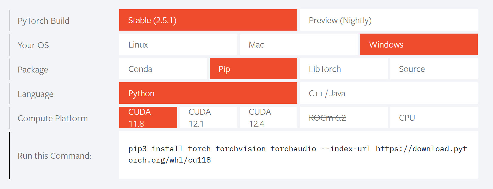

# Requirements

## 基础需求
1. Python（选择以下之一，建议选择最新版本）
   * pip [Python 默认的包管理工具]
      [https://https://www.python.org/downloads/windows/](https://www.python.org/downloads/windows/)
   * anaconda/miniconda  [一个专为数据科学设计的大型 Python 发行版]
      https://www.anaconda.com/download

   注意: 使用前请配置 pip/conda 的镜像源。
   1. [pip] https://mirrors.tuna.tsinghua.edu.cn/help/pypi/
   2. [anaconda] https://mirrors.tuna.tsinghua.edu.cn/help/anaconda/
2. VSCode/Pycharm [集成开发环境 (IDE)]

## 机器学习
如果安装了 Anaconda，多数常用的机器学习包已经包含在内。

对于使用 pip 的用户，请安装以下包：
1. numpy
2. sklearn
3. scipy
4. matplotlib

## 神经网络
PyTorch 是目前最受欢迎的神经网络框架。如果你有 NVIDIA GPU，请选择与你的 NVIDIA 驱动版本匹配的 CUDA 版本。

## CFD
1. 推荐使用 Fluent 或 OpenFOAM 来生成流体场数据集。
2. 推荐使用 Paraview 进行后处理。

## 其他建议
1. 确保为您的系统和硬件选择正确版本的包和框架。
2. 为了更好地完成机器学习和神经网络任务，请确认 GPU 驱动和 CUDA 版本之间的兼容性。